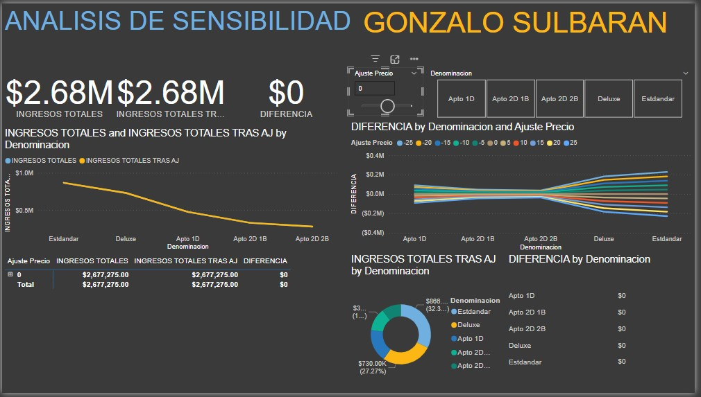
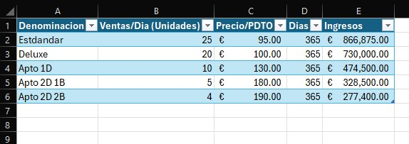
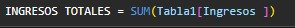
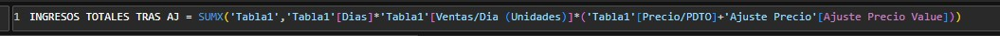
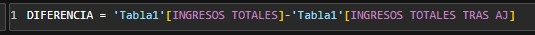
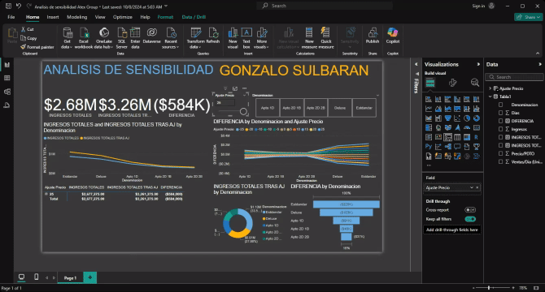

# rentalproject
gonzalo rental project


# Table of contents 

- [Objective](#objective)
- [User Story](#User-story)
- [Data Source](#data-source)
- [Stages](#stages)
- [Design](#design)
  - [Tools](#tools)
- [Development](#development)
  - [Pseudocode](#pseudocode)
  - [Data Exploration](#data-exploration)
- [Visualization](#visualization)
  - [DAX Measures](#dax-measures)
- [Analysis](#analysis)
- [Output](#output)
 
 


# Objective 

- What is the key pain point? 

the Owner of some properties needs to know, how much his project of renting apartments per day on Airbnb can vary in variations of the price per day, so he can see if even in the worst case scenario the project is still profitable.


- What is the ideal solution? 

To create a dashboard that provides insights to see the diference in net profit versus price variation 
- expected net profit
- table net profits and diference in price
- price slicer
- apartments
- net profits by apartments
  

This will help the owner make informed decisions about which apartments still profitable in the worst case.

## User story 

As the Owner, I want to use a dashboard that analyses net profits in diference price. 

This dashboard should allow me to identify the top performing apartments based on change in circumstancess. 


# Data source 

- What data is needed to achieve our objective?

We need data on the apartments 
- apartments price
- rental price/per day
- number of days in a year
- total of apartments


- Where is the data coming from? 
The data is sourced from the owner's dataset (an Excel extract), [see here to find it.](assets/datasets/ANALISIS-DE-SENSIBILIDAD.xlsx)


# Stages

- Design
- Developement
- Analysis 
 


# Design 

## Dashboard components required 
- What should the dashboard contain based on the requirements provided?

To understand what it should contain, we need to figure out what questions we need the dashboard to answer:

1. how many apartments are?
2. what is the price of each apartment by type?
3. how much can the rental price vary?
4. how many apartments are expected to be rented in a year?





## Tools 


| Tool | Purpose |
| --- | --- |
| Excel | Exploring the data |
| Power BI | Visualizing the data via interactive dashboards |
| GitHub | Hosting the project documentation and version control |


# Development

## Pseudocode

- What's the general approach in creating this solution from start to finish?

1. Get the data
2. Explore the data in Excel
3. Visualize the data in Power BI
4. Generate the findings based on the insights
5. Publish the data to GitHub Pages

## Data exploration notes

This is the stage where you have a scan of what's in the data, errors, inconcsistencies, bugs, weird and corrupted characters etc  


- What are your initial observations with this dataset? What's caught your attention so far? 

 There are at least 4 columns that contain the data we need for this analysis, which signals we have everything we need from the file without needing to contact the client for any more data. 





# VISUALIZATION


## DAX Measures


### 1. Net Profits 
```sql
INGRESOS TOTALES = 
SUM(Tabla1[Ingresos])


RETURN totalNetProfit

```


### 2. adjusted net income 
```sql
Ajusted Net Profit = 
SUM{'Tabla1','Tabla1'[Dias]*'Tabla1'[Ventas/Dia (Unidades)]*('Tabla1'[Precio/DPTO+'Ajuste Precio'[Ajuste Precio Value])}

RETURN AjustedNetPrice

```



### 3. Ajusted net price difference
```sql
Difference = 'Tabla1'[totalNetProfit]-'Tabla1'[AjustedNetPrice]

RETURN totalDifference

```



#### Output




